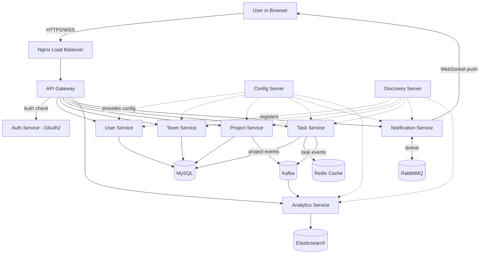

# TeamForge — Enterprise Team Management Platform

TeamForge is a full-stack, microservices-based team management platform —
teams, members, projects, tasks, roles/permissions, real-time notifications,
and analytics — built the way large enterprise systems are: an API Gateway in
front of independently deployable services, event-driven communication,
polyglot persistence, and containerized deployment to the cloud.

This README is the single source of truth for the project: what it is, how
it's organized, how the pieces talk to each other, and what's built vs planned.

---

## Table of contents

1. [What it does (features)](#1-what-it-does-features)
2. [Tech stack](#2-tech-stack)
3. [Architecture](#3-architecture)
4. [System flowchart](#4-system-flowchart)
5. [Folder structure](#5-folder-structure)
6. [UI overview](#6-ui-overview)
7. [Data model](#7-data-model)
8. [Build status & roadmap](#8-build-status--roadmap)
9. [Local development](#9-local-development)

---

## 1. What it does (features)

**Core team management**
- Create and manage **Teams**, add/remove members
- Create **Projects** under a team, track status and progress
- Create **Tasks** under a project — board (kanban) and table views, assignment, due dates, status
- **Roles & Permissions** (RBAC) — Admin / Manager / Member, with a permission matrix

**Platform features**
- **Authentication** via OAuth2 (Keycloak-backed), JWT-secured APIs
- **Real-time notifications** over WebSockets (task assigned, status changed, mentions)
- **Analytics dashboard** — team velocity, workload distribution, completion rate, activity feed
- **Global search** across teams/projects/tasks/users
- **Audit logs** — who changed what, when
- **System health** — live status of every microservice
- **AI-assisted insights** (Spring AI) — e.g. workload rebalancing suggestions, project risk flags

**Engineering features (non-functional)**
- Independently deployable microservices behind an API Gateway
- Centralized configuration (Spring Cloud Config) and service discovery (Eureka)
- Event-driven updates via Kafka (analytics/audit) and RabbitMQ (notification delivery)
- Caching via Redis, full-text/aggregation search via Elasticsearch
- Containerized with Docker, orchestrated with Kubernetes, provisioned with Terraform on AWS
- CI/CD pipeline, test coverage (JUnit/Mockito), code quality gate (SonarQube)
- Observability: Prometheus metrics, Grafana dashboards, centralized logs (ELK)

---

## 2. Tech stack

| Layer | Technologies |
|---|---|
| Frontend | React 18, Vite, Tailwind CSS, React Router, Recharts, WebSockets, Zustand |
| Backend | Java 21, Spring Boot 3, Spring Cloud Gateway, Spring Cloud Config, Spring Security (OAuth2/JWT), Spring Data JPA, Spring AI |
| Databases & messaging | MySQL (primary store), Redis (cache), Elasticsearch (search/analytics), Kafka (event streaming), RabbitMQ (notification queue) |
| Infra & deployment | Docker, Kubernetes, Terraform, AWS (EC2, RDS, ElastiCache, S3, CloudWatch), Nginx |
| CI/CD & quality | GitHub Actions, Jenkins (optional), JUnit 5, Mockito, Postman, Swagger/OpenAPI, SonarQube |
| Observability | Prometheus, Grafana, Logstash, Kibana |

---

## 3. Architecture

Client traffic enters through Nginx, hits the API Gateway, which authenticates
the request (OAuth2/JWT) and routes it to the correct domain microservice.
Every service registers itself with the discovery server and pulls its config
from the config server at startup. Services talk to their own database
(no shared DB), and communicate with each other asynchronously through
Kafka/RabbitMQ rather than direct calls, where possible.

```
Client (React SPA)
   │  HTTPS / WSS
   ▼
Nginx (reverse proxy / load balancer)
   │
   ▼
API Gateway (Spring Cloud Gateway) ── validates JWT, routes by path
   │
   ├──► Auth Service (OAuth2 / Keycloak) ── issues & validates tokens
   ├──► User Service ──────────► MySQL
   ├──► Team Service ──────────► MySQL
   ├──► Project Service ───────► MySQL
   ├──► Task Service ──────────► MySQL + Redis (cache)
   ├──► Notification Service ──► RabbitMQ + WebSocket push to client
   └──► Analytics Service ─────► Elasticsearch + Kafka consumer + Spring AI

All services ──► Config Server (central config)
All services ──► Discovery Server (Eureka, service registry)
Task/Project/User events ──► Kafka ──► Analytics Service (for reporting)
```

---

## 4. System flowchart



---

## 5. Folder structure

```
teamforge/
├── README.md                   ← you are here
├── docs/
│   ├── ROADMAP.md               Build order & progress tracker
│   └── API.md                   (planned) OpenAPI/Swagger reference
│
├── frontend/                    React 18 + Vite + Tailwind dashboard
│   └── src/
│       ├── components/          Reusable UI (Sidebar, Topbar, StatCard, etc.)
│       ├── pages/                Route-level pages (Dashboard, Teams, Tasks...)
│       ├── layouts/              App shell layout
│       ├── charts/               Recharts wrappers (velocity, workload, etc.)
│       ├── lib/                  API client, WebSocket client, utils
│       └── store/                Zustand state stores
│
├── services/                    Java 21 / Spring Boot 3 microservices
│   ├── config-server/            Spring Cloud Config Server
│   ├── discovery-server/         Eureka service registry
│   ├── api-gateway/               Spring Cloud Gateway
│   ├── auth-service/              OAuth2 / JWT issuing
│   ├── user-service/              Users, roles, permissions (MySQL)
│   ├── team-service/              Teams, memberships (MySQL)
│   ├── project-service/           Projects (MySQL)
│   ├── task-service/              Tasks/boards (MySQL + Redis)
│   ├── notification-service/      WebSocket + RabbitMQ
│   └── analytics-service/         Elasticsearch + Kafka + Spring AI
│
└── infra/
    ├── docker/                    docker-compose for full local stack
    ├── k8s/                        Kubernetes manifests, one folder per service
    └── terraform/                  AWS modules (VPC, EC2, RDS, ElastiCache, S3)
```

---

## 6. UI overview

The dashboard follows a persistent sidebar + topbar app-shell layout:

- **Sidebar** — navigation across Dashboard, Teams, Projects, Tasks, Users,
  Roles & Permissions, Notifications, Analytics, Settings, Audit Logs, System Health
- **Topbar** — global search, notification bell (live WebSocket badge), profile menu
- **Dashboard home** — stat cards (Active Teams, Open Tasks, Completion Rate,
  Team Velocity), a velocity trend chart, a recent activity feed, top
  performers, workload breakdown donut chart, and system health widget
- **Teams** — list + detail view with member management
- **Projects** — list view and kanban board
- **Tasks** — board and table views with a task detail drawer
- **Users & Roles** — user list and a permission matrix for RBAC
- **Analytics** — deeper charts on velocity, workload, and completion trends
- **Settings / Audit Logs / System Health** — admin-only pages

Visual identity (details in `frontend/DESIGN.md` once Phase 1 styling lands):
dark steel sidebar, light content area, an ember/amber accent (nods to the
"Forge" in TeamForge) used sparingly for active states and primary actions —
Space Grotesk for headings, Inter for body text, JetBrains Mono for metrics.

---

## 7. Data model (high level)

```
User ──< TeamMembership >── Team ──< Project ──< Task >── User (assignee)
User ──< Role (via UserRole) >── Permission
Task ──> Notification (on assign/status change) ──> User
Task/Project events ──> AnalyticsEvent (Kafka) ──> Elasticsearch index
```

Full entity-relationship diagrams and field-level schemas land with each
service in Phase 3 of the roadmap.

---

## 8. Build status & roadmap

This project is being built **incrementally and commit-by-commit** — every
commit is small, real, and reviewed before merging. See
[`docs/ROADMAP.md`](docs/ROADMAP.md) for the full phase-by-phase breakdown and
live progress checklist.

Current phase: **Phase 1 — Frontend dashboard** (in progress)

---

## 9. Local development

Local dev instructions will be added as each piece comes online:
- Frontend-only dev server instructions land with Phase 1
- Full docker-compose stack (all services + MySQL/Redis/Kafka/RabbitMQ/Elasticsearch) lands in Phase 5

